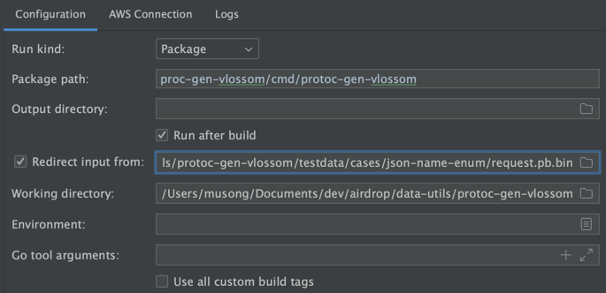

# protoc-gen-debug

When developing a protoc plugin, it is difficult to use debug mode (breakpoint) because of the way protoc communicates with the plugin.

To debug, you need to pseudo-mimic protoc's input, which is hard to do because protoc and plugin communicate in protobuf, a format that is hard for humans to read.

This plugin helps you dump protoc's input so you can use it to develop other plugins.

## Installation
You can install it from the [Github Release](https://github.com/pubg/protoc-gen-debug) or with the command below.

```sh
go install github.com/pubg/protoc-gen-debug
```

## Example


### Dump protoc's input
```sh
protoc \
    --debug_out=./ \
    --debug_opt=dump_file=request.pb.bin \
    --debug_opt=parameter=expose_all=true \
    -I ./ \
    ./example.proto
```

#### Run your plugin with the dumped input via command-line
```sh
cat request.pb.bin | ./protoc-gen-myplugin
cat request.pb.bin | go run ./cmd/main.go
```

#### Run your plugin with the dumped input via Goland


1. Check `Redirect input from`
2. Set dumped file path
3. Run as Debug Mode

## Options
| Option    | Description                           | Default        |
|-----------|---------------------------------------|----------------|
| dump_file | A file name to save protoc's input to | request.pb.bin |
| parameter | Parameters for other plugins          | ""             |

