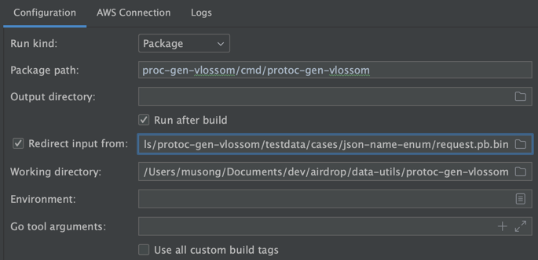

# protoc-gen-debug

Debugging a protoc plugin is difficult because protoc communicates with plugins using protobuf, a binary format that is not human-readable.

As a result, it’s not easy to reproduce or inspect the input that protoc sends to a plugin, which makes setting breakpoints and using a debugger cumbersome.

This plugin addresses that issue by capturing and dumping protoc’s input, allowing you to easily reuse it for debugging and developing other plugins.

## Installation
You can install it from the [Github Release](https://github.com/pubg/protoc-gen-debug) or with the command below.

```sh
go install github.com/pubg/protoc-gen-debug@latest
```

## Example

### Dump protoc's input
```sh
protoc \
    --debug_out=./ \
    --debug_opt=dump_binary=true \
    --debug_opt=dump_json=true \
    --debug_opt=file_binary=request.pb.bin \
    --debug_opt=file_json=request.pb.json \
    --debug_opt=parameter=expose_all=true:foo=bar \
    -I ./ \
    ./example.proto
```

#### Run your plugin with the dumped input via command-line
```sh
cat request.pb.bin | ./protoc-gen-myplugin
cat request.pb.bin | go run ./cmd/main.go
```

#### Run your plugin with the dumped input via Goland


1. Check `Redirect input from`
2. Set dumped file path
3. Run as Debug Mode
4. Happy Debugging!

## Options
| Option      | Description                         | Type                   | Default         |
|-------------|-------------------------------------|------------------------|-----------------|
| dump_binary | Enable or not to dump binary format | bool                   | true            |
| file_binary | File name to save protoc's input    | string                 | request.pb.bin  |
| dump_json   | Enable or not to dump json format   | bool                   | false           |
| file_json   | File name to save protoc's input    | string                 | request.pb.json |
| dump_text   | Enable or not to dump text format   | bool                   | false           |
| file_text   | File name to save protoc's input    | string                 | request.pb.txt  |
| parameter   | Parameters for other plugins        | colon seperated string | ""              |

